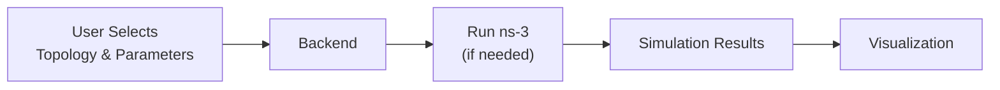
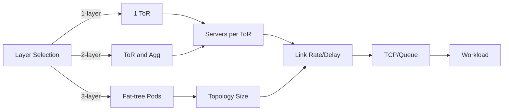

# DCN Visualization

Interactive ns-3 network traffic simulator and visualization tool for analyzing packet-level behavior, congestion patterns, and queue dynamics across configurable network topologies.

Currently, the tool supports configurable 1-layer, 2-layer, and 3-layer data center topologies, with extensible support for more general network structures.

> Developed as a semester project in the [Network Architecture Lab](https://www.epfl.ch/labs/nal/) at EPFL. The report will be available soon.

## Quick Start

```bash
cd backend
uv run fastapi run --port 8001
```

```bash
cd frontend
npm install
npm run dev
```

```bash
# after ns-3 source changes
cd ns3
./ns3 build -j1
```

Open `http://localhost:3000` and launch simulations.

## How it was Implemented



| Layer        | Stack |
|--------------|------------------|
| Frontend     | React, Next.js, TypeScript |
| Backend      | FastAPI |
| Simulation   | ns-3, C++ |

## How it Works

1. Configure the topology and transport settings in the frontend.



2. Start a run from the UI.
3. FastAPI launches ns-3 and stores outputs under `backend/output/<runTag>`.
4. The frontend fetches completed packet traces and renders queue graphs and playback.
