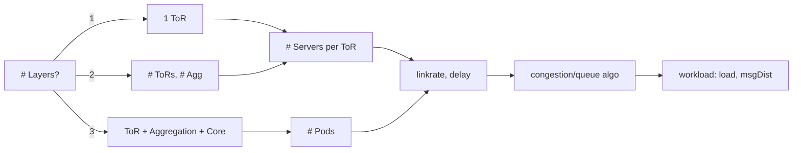

# DCN Network Visualization

>[!NOTE]
> This is a semester project currently being updated and planned to be finalized by June.



## Quick Start

```bash
# cd backend && uv run fastapi dev main.py
cd backend && uv run fastapi run --port 8001
cd frontend && npm run dev
```

```bash
tmux
./ns3 build -j1
```

## Tech Stack

| Layer        | Stack |
|--------------|------------------|
| Frontend     | React, Next.js |
| Backend      | FastAPI, RQ |
| Simulation   | ns-3 |
<!-- | Storage      | AWS | -->


